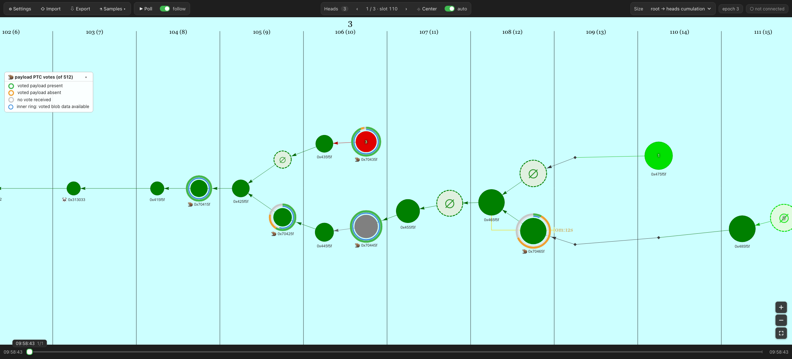
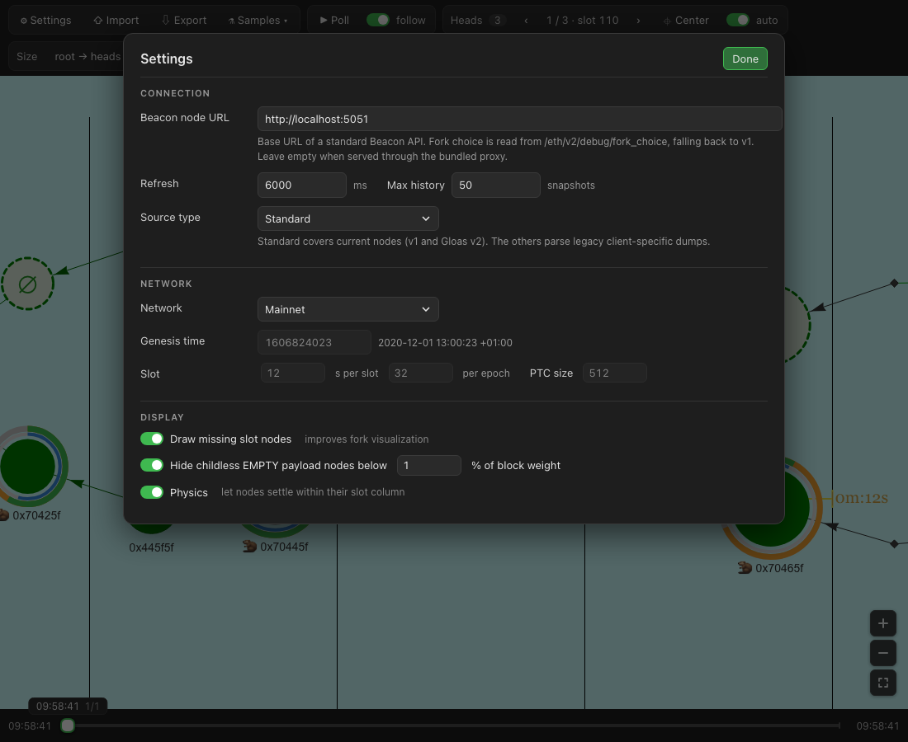

# ProtoArray visualization tool

Visualizes a beacon node's fork choice (proto-array) as a slot-by-slot graph.

**Supports the standard fork choice debug API (v1, and v2 for Gloas / EIP-7732) plus the old
Teku, Prysm and Nimbus proprietary dump formats.**



Older demo video (pre-Gloas UI): https://user-images.githubusercontent.com/15999009/186433395-c1ba217b-6e3f-4936-bbed-38b1261cbfd6.mov

## Running it

The app is a Create React App project managed with yarn (`yarn.lock` is tracked).

```
yarn install
yarn start              # dev server on http://localhost:3000
yarn build              # production build in build/
CI=true yarn test --watchAll=false src/beaconApi src/forkChoiceApi   # unit tests
yarn gen:gloas-testdata # regenerate src/testDataGloas.json from scripts/genGloasTestData.js
```

`src/App.test.js` is Create React App boilerplate and does not run (Jest cannot load vis-network);
the unit tests live next to `src/beaconApi.ts` and `src/forkChoiceApi.ts`.

## Connecting to a node

Settings → "Beacon node URL" takes the base URL of any node exposing the standard
[Beacon API](https://github.com/ethereum/beacon-APIs), e.g. `http://localhost:5051`.
Press **Poll** in the toolbar to start fetching; the chip at the top right shows whether the
node answers and which fork choice API version is in use (hover it for endpoint details).

Fork choice is read from `/eth/v2/debug/fork_choice` when the node supports it
([beacon-APIs#615](https://github.com/ethereum/beacon-APIs/pull/615)), falling back to
`/eth/v1/debug/fork_choice` otherwise. Both the plain and the `data`-wrapped response shapes are
accepted.

With Network set to **Auto** (the default) the genesis time, slot duration, slots per epoch and PTC size are
read from the node (`/eth/v1/beacon/genesis` and `/eth/v1/config/spec`) whenever the settings
are applied or polling is started.



The browser talks to the node directly, so the node must allow cross-origin requests
(e.g. Teku: `--rest-api-cors-origins="http://localhost:3000"`). Alternatively run the
`server/` app: it serves the production build and proxies `/eth/*` to the node given in
`PROTO_ENDPOINT`; leave "Beacon node URL" empty to use it.

```
yarn build
cd server && yarn install
PORT=8080 PROTO_ENDPOINT=http://localhost:5051 node server.js
```

## Gloas (ePBS) view

With API v2, each Gloas block is shown as its PENDING block node on the left half of the slot
column plus its payload nodes on the right half: EMPTY (hollow dashed `∅`) and FULL
(`🦫` + execution block hash prefix). Child blocks hang from the payload node they were built on.
Pre-Gloas blocks keep the single node with the `🐼` marker for post-merge blocks.

FULL payload nodes carry rings showing the PTC (Payload Timeliness Committee) vote as a share of
the whole committee (`PTC_SIZE` from the node's spec, 512 on mainnet by default): outer ring
green = voted payload present, orange = voted payload absent, grey = no vote received; inner blue
ring = voted blob data available. A draggable, foldable legend appears whenever payload nodes
are shown.

Childless EMPTY nodes carrying less than a configurable share of their block's weight (default
1%) are hidden (Settings → Display → "Hide childless EMPTY payload nodes"); a block whose payload
was never revealed always keeps its EMPTY node.

## Sample data

The toolbar's **Samples** menu loads bundled dumps and selects the matching source type:

- **Legacy Teku dump** (`src/testData.json`): pre-standard Teku format.
- **Synthetic Gloas dump** (`src/testDataGloas.json`): a v2 dump with a pre-Gloas boundary, a
  fork on an EMPTY payload, an unrevealed payload, an EMPTY node that is a head, a late block, a
  skipped slot and mixed PTC votes. Edit the scenario in `scripts/genGloasTestData.js` and run
  `yarn gen:gloas-testdata` to regenerate it.

**Export** saves the current history (all polled snapshots) as JSON. **Import** accepts either a
single fork choice response in the selected source type's format or a previously exported history.

URL parameters are applied on start, useful for bookmarks and screenshots:
`?sample=gloas` or `?sample=teku` loads a bundled dump, `?network=mainnet|goerli|sepolia|custom|auto`
selects the network (a fixed network skips node detection), `?zoom=0.7` fixes the zoom used whenever the view centers on the head,
`?settings=1` opens the settings dialog.
The screenshot above is `http://localhost:3000/?sample=gloas&network=mainnet&zoom=0.7` captured
with headless Chrome:

```
"/Applications/Google Chrome.app/Contents/MacOS/Google Chrome" --headless=new --hide-scrollbars \
  --window-size=2200,1000 --virtual-time-budget=20000 --screenshot=docs/screenshot.png \
  "http://localhost:3000/?sample=gloas&network=mainnet&zoom=0.7"
```

The settings screenshot is `?sample=gloas&network=mainnet&settings=1` at 1100×900.

## Docker

The image runs the development server on port 3000 (note: `npm install` inside the image does
not use `yarn.lock`).

```
docker build -t proto-vis .

docker run -p 3000:3000 proto-vis
```
